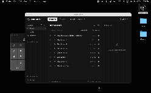

<p align="center">
  
</p>

<h1 align="center">BetterMacro</h1>

<p align="center">
  <strong>A better macro recorder for macOS.</strong><br>
  Record what you do, clean it up, and replay it whenever you need.
</p>

<p align="center">
  
</p>

<p align="center">
  macOS 12.6+ • Intel and Apple Silicon • Free and open source
</p>

## What is BetterMacro?

BetterMacro is a free and open source macro recorder for macOS.

It records your keyboard, mouse, scrolling, clicks, drags, and other interactions, then turns them into a timeline you can edit and replay.

Most macro recorders mainly remember where you clicked on the screen.

BetterMacro can also figure out what you clicked.

Instead of only saving something like

```text
Click at x: 824, y: 516
```

it can identify the actual button, file, field, or interface element you interacted with.

This means a macro has a much better chance of still working after a window moves or something on screen changes.

Everything runs locally on your Mac. There is no account, no telemetry, and no cloud processing.

## Download

### macOS

**[Download the latest BetterMacro release](../../releases/latest)**

BetterMacro supports:

* macOS 12.6 Monterey and newer
* Apple Silicon Macs
* Intel Macs

### How to install it

1. Download the latest `.dmg` from the [Releases](../../releases) page.
2. Open the DMG.
3. Drag BetterMacro into your Applications folder.
4. Open BetterMacro.

That's all you need to do.

### If macOS blocks the app

BetterMacro is currently unsigned and not notarized, so macOS may block it the first time you try to open it.

If that happens:

1. Open your Applications folder.
2. Right click or Control click BetterMacro.
3. Click **Open**.
4. Click **Open** again when macOS asks.

You should only have to do this once.

## Permissions

BetterMacro needs a couple of macOS permissions to record and replay what you do.

### Accessibility

This lets BetterMacro understand interface elements and control your Mac during playback.

### Input Monitoring

This lets BetterMacro record keyboard and mouse input.

BetterMacro asks for these permissions when it needs them.

If you denied one earlier, you can enable it from the Privacy and Security section in macOS settings.

Screen Recording is not needed for normal recording or playback.

## Make your first macro

The basic workflow is simple:

1. Start recording.
2. Do whatever you want to automate.
3. Stop recording.
4. Check the recorded actions.
5. Edit anything you want.
6. Press play.

Your recording shows up as a readable timeline instead of a pile of coordinates and raw events.

You can move actions around, edit them, or disable things you do not want to replay.

## What makes BetterMacro different?

A normal macro recorder often depends heavily on fixed screen coordinates.

That works fine until you move a window.

BetterMacro also uses macOS Accessibility information to understand the interface you are interacting with.

### It can understand what you click

BetterMacro can save information about things like:

* Buttons and controls
* Labels
* Values
* File names
* Windows
* Parent interface elements
* Native actions
* Accessibility hierarchy

During playback, BetterMacro tries to find the same element again.

If it cannot confidently tell which element is the right one, it stops instead of clicking somewhere random.

### It records normal mouse and keyboard input too

BetterMacro can record:

* Keyboard input
* Mouse clicks
* Mouse movement
* Dragging
* Trackpad and mouse scrolling
* Desktop interactions

### You can edit your recording

You are not stuck with whatever got recorded the first time.

You can:

* Edit actions
* Disable actions
* Drag actions into a different order
* Undo and redo changes
* Import and export macros
* Save macros locally
* Search and filter your macro library

### Smooth mouse playback

Mouse movement is replayed smoothly rather than teleporting from one position to another.

You can adjust playback speed and choose between 60, 120, or 240 pointer events per second.

There is also an immediate Stop button and a global emergency stop using `⌃⌥Esc` when that shortcut is available.

### macOS actions

BetterMacro can also handle things like:

* Mission Control
* Show Desktop
* Reveal Dock
* Desktop and Dock workflows

macOS does not provide a supported way for apps to generate a literal three finger trackpad gesture, so BetterMacro recreates the result using supported macOS shortcuts and system APIs.

## Privacy

BetterMacro is local first.

There is:

* No account
* No telemetry
* No cloud sync
* No automatic AI requests

Your macros are stored here:

```text
~/Library/Application Support/BetterMacro/macros
```

BetterMacro also respects macOS Secure Input and does not try to bypass it.

## Building from source

You do not need any of this if you only want to use BetterMacro.

This section is for people who want to work on the project.

### Requirements

You will need:

* macOS
* Node.js 20+
* Rust stable
* Xcode or Xcode Command Line Tools

Clone the repository:

```sh
git clone <your BetterMacro repository clone URL>
cd BetterMacro
```

Install dependencies:

```sh
npm install
```

Run BetterMacro:

```sh
npm run tauri dev
```

### Build the app

```sh
npm run tauri build
```

The finished app and DMG will be placed in:

```text
src-tauri/target/release/bundle/
```

### Build for Intel and Apple Silicon

```sh
rustup target add aarch64-apple-darwin x86_64-apple-darwin

npm run tauri build -- --target aarch64-apple-darwin
npm run tauri build -- --target x86_64-apple-darwin
```

The project is set up for Universal Binary builds.

## How it works

BetterMacro uses native macOS APIs for recording and playback, with a Tauri interface on top.

```text
src/
React editor, timeline, inspector and permission UI

src-tauri/src/macos.rs
macOS recording, permissions and playback

src-tauri/src/model.rs
Macro and action format

src-tauri/src/storage.rs
Local macro storage
```

If you want to dig deeper into the internals, see the [architecture notes](docs/architecture.md).

## Current limitations

BetterMacro is still being actively worked on.

A few things to know:

* BetterMacro currently only supports macOS.
* The app is currently unsigned and not notarized.
* Literal three finger trackpad gestures cannot be generated through supported macOS APIs.
* Actions like Mission Control and Show Desktop are recreated using supported system shortcuts.
* Image based targeting is not part of the current version.

Found a bug or something that does not work the way you expected?

[Open an issue](../../issues).

## Contributing

Bug reports, ideas, and contributions are welcome.

See [CONTRIBUTING.md](CONTRIBUTING.md) if you want to help out.

And if BetterMacro is useful to you, starring the repository helps other people find it.

## License

BetterMacro is released under the [MIT License](LICENSE).
